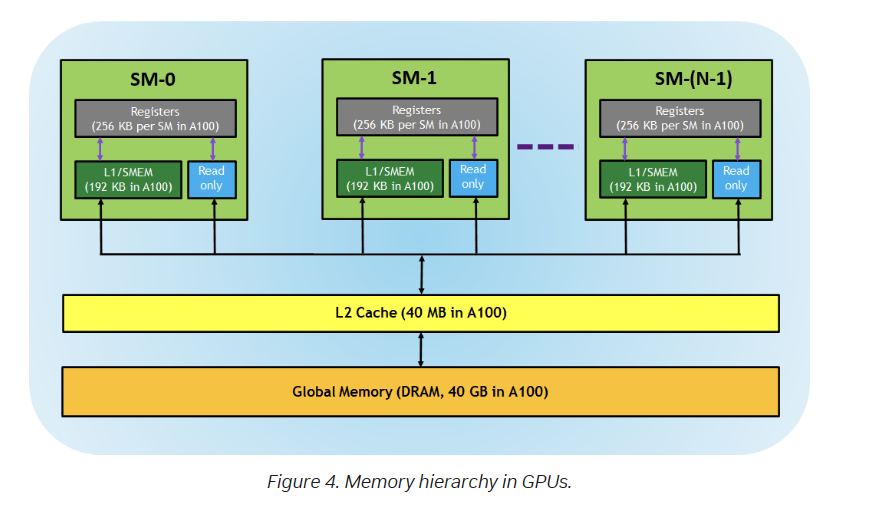

# CUDA Notes

## Threads vs Blocks vs Grids

In CUDA programming, understanding the hierarchical relationship between threads, blocks, and grids is crucial for efficiently mapping computational problems onto the GPU's parallel architecture. Here's a breakdown:

### 1. Thread

- **Definition**: The smallest unit of execution in CUDA. A thread runs a set of instructions.
  
- **Use**: Each thread is typically used to handle a small portion of the larger computational task. For example, if the task is to add elements from two arrays, each thread might handle the addition of one element from each array.
  
- **Identity**: Threads are identified using the built-in `threadIdx` variable. This can be 1D (`threadIdx.x`), 2D (`threadIdx.x`, `threadIdx.y`), or 3D (`threadIdx.x`, `threadIdx.y`, `threadIdx.z`), depending on how you structure your threads within a block.

- **Memory**: Each thread has access to its private local memory, registers, and also to the shared memory of its block.

### 2. Block

- **Definition**: A block is a group of threads that can cooperate with each other by sharing data through shared memory and by synchronizing their execution to coordinate memory accesses.

- **Use**: Blocks facilitate the partitioning of your problem into chunks. Using our array addition example, if each thread adds one element, a block might handle the addition of, say, 128 elements.

- **Identity**: Blocks are identified within a grid using the `blockIdx` variable, which can also be 1D, 2D, or 3D (`blockIdx.x`, `blockIdx.y`, and `blockIdx.z`).

- **Memory**: All threads in a block share a common shared memory space, which is faster than global memory but is limited in size.

- **Size**: The number of threads in a block is defined by the `blockDim` variable.

### 3. Grid

- **Definition**: A grid is the highest level in the hierarchy and is a collection of blocks.

- **Use**: The entire computational task is divided into one or more grids. If you have a very large array (say, millions of elements), you'd distribute this across multiple blocks, and those blocks would be organized into a grid.

- **Identity**: The dimensions of the grid, meaning how many blocks are in the grid, can be accessed with the `gridDim` variable.

- **Dimensions**: Just like threads and blocks, grids can be 1D, 2D, or 3D.

- **Memory**: The entire grid has access to the global memory of the device, which is the largest memory space available but also has the highest access latency.

### Conceptual Analogy

- **Thread**: Imagine it as an individual worker in a company.
  
- **Block**: A team or department in that company where each worker (thread) has a specific role. They can quickly communicate and collaborate because they're in close proximity.

- **Grid**: The entire company with all its departments (blocks). Each department handles a segment of the company's overall workload.

### Importance

## IDs & Dims

Understanding the distinction and hierarchy of threads, blocks, and grids is essential because it allows developers to efficiently leverage the parallel processing capabilities of the GPU. The architecture offers flexibility in how problems are divided and mapped onto the hardware, ensuring scalability and optimal performance across different GPU architectures.
In CUDA programming, both thread ID and block ID are essential concepts for specifying the unique identity of a thread within the entire grid. However, they serve different purposes and have different scopes:

1. **Thread ID**:
   - **Scope**: Within a block.
   - **Use**: To uniquely identify a thread within its block.
   - **Accessed via**: `threadIdx` built-in variable.
   - **Dimensions**: `threadIdx.x`, `threadIdx.y`, and `threadIdx.z` for 1D, 2D, and 3D thread configurations, respectively.

   Each block can have multiple threads, and these threads are identified using their thread ID. If you consider a block as a small group or team, the thread ID would be an identifier of an individual within that team.

2. **Block ID**:
   - **Scope**: Within the grid.
   - **Use**: To uniquely identify a block within the entire grid of blocks.
   - **Accessed via**: `blockIdx` built-in variable.
   - **Dimensions**: `blockIdx.x`, `blockIdx.y`, and `blockIdx.z` for 1D, 2D, and 3D block configurations, respectively.

   The grid consists of multiple blocks, and each block is identified by its block ID. If you consider the grid as a collection of teams, the block ID would be the identifier of each team within that collection.

**Relating the two**: To uniquely identify a thread within the entire grid (across all blocks), you'll often combine the block ID with the thread ID and the dimensions of the block. For example, for a 1D grid of 1D blocks, the unique global ID for a thread might be computed as:

```c++
int globalID = blockIdx.x * blockDim.x + threadIdx.x;
```

In this way, `blockIdx` and `blockDim` work together to situate a thread in the global context, while `threadIdx` identifies its position within its local block.

## `__syncthreads()`

Certainly. The `__syncthreads()` function is a synchronization barrier used in CUDA programming. It ensures that all threads within a block reach the same point in execution before any of them can proceed further. This is crucial for many parallel algorithms where threads need to share intermediate results with one another through shared memory. Here's a more detailed explanation:

### Why Do We Need `__syncthreads()`?

In CUDA, threads within the same block can communicate and synchronize via shared memory. Shared memory is faster than global memory but is limited in size and scope. However, due to the SIMT (Single Instruction, Multiple Threads) architecture of NVIDIA GPUs, threads may not always execute instructions at the exact same time, even within a warp. This can lead to race conditions, where the outcome depends on the sequence or timing of uncontrollable events.

To avoid such race conditions and ensure data consistency, CUDA provides the `__syncthreads()` function. It ensures that:

1. All threads in a block have reached the barrier and completed their previous instructions.
2. Any writes to shared memory made before the barrier are visible to all threads in the block after the barrier.

### Example

Consider a simple scenario where threads within a block are used to compute a sum of elements in an array, and they store intermediate sums in shared memory:

```cuda
__global__ void computeSum(int* input, int* output) {
    __shared__ int sharedData[THREADS_PER_BLOCK];

    int tid = threadIdx.x;
    int localData = input[tid];

    // Some computation on localData
    sharedData[tid] = localData;

    __syncthreads();  // Synchronize to make sure all writes to shared memory are done

    // Imagine a reduction operation here that uses the data stored in sharedData
    // ...

    output[tid] = sharedData[tid];
}
```

In this example, if we didn't have `__syncthreads()`, there's no guarantee that all threads have completed writing their local data to `sharedData` before the reduction operation begins. This might lead to incorrect or unpredictable results.

### Important Points

1. `__syncthreads()` only synchronizes threads within the same block. Threads in different blocks cannot be synchronized using `__syncthreads()`.
2. Overuse of `__syncthreads()` can hinder performance, as it stalls threads. It should be used judiciously.
3. Deadlock can occur if not all threads within a block reach `__syncthreads()`. It's vital to ensure that all threads will hit the synchronization barrier when using this function.

In summary, `__syncthreads()` ensures that all threads in a block reach a certain point in their execution before any of them proceed, ensuring data consistency and preventing race conditions when working with shared memory.

## Warp (Hardware Level)

In the context of CUDA and NVIDIA GPUs, a warp is a fundamental unit of execution. Here's a deeper look:

### Definition

A warp consists of 32 threads that are executed in parallel by the GPU. These threads start together at the same program address, but they can diverge if different execution paths are taken due to conditional statements.

### Warp Execution

- **SIMT Architecture**: NVIDIA GPUs are designed based on the Single Instruction, Multiple Thread (SIMT) architecture. This means that for each instruction cycle, every single thread in a warp executes the same instruction, but possibly on different data.

- **Divergence**: If threads within a warp follow different execution paths (for example, due to an `if` statement), the warp "diverges". The different paths are then serialized. This means the warp will execute each branch path one after the other, effectively reducing the warp's execution efficiency. Once all paths are complete, the warp converges back to a single execution path.

- **Performance Implications**: To achieve maximum performance, it's generally recommended to minimize warp divergence. If all threads in a warp take the same execution path, then they can execute in parallel without serialization, making the most of the GPU's capabilities.

### Scheduling

- **Warp Scheduler**: Modern NVIDIA GPUs have warp schedulers, which determine the execution of warps. When a warp is scheduled, its 32 threads are executed in lockstep.

- **Latency Hiding**: Warps play a key role in the GPU's ability to hide memory access latencies. If one warp is waiting for data (e.g., a global memory read), the scheduler can quickly switch to another warp that's ready to execute. This ability to rapidly context-switch between warps, with virtually no overhead, allows the GPU to keep its execution units busy most of the time, thus maximizing throughput.

### Relation to Blocks

A block, as defined in the CUDA programming model, consists of multiple threads. These threads are grouped into warps for execution. For example, if a block has 128 threads, it would be divided into 4 warps, each containing 32 threads.

### Warp Size

While current NVIDIA GPUs have a warp size of 32 threads, it's worth noting that this is a hardware-specific detail. Programmers usually aim to write warp-efficient code but should avoid hardcoding assumptions about warp size when aiming for forward compatibility.

### In Conclusion

Warps are crucial to understanding the efficiency and performance nuances of CUDA code on NVIDIA GPUs. By being aware of how warps operate, developers can make informed decisions when structuring their kernel code and optimizing for performance.

## Memory Hierarchy




### Registers

- **Description**: Registers are the smallest, fastest form of memory and are private to each thread.
- **Visibility**: Each thread's registers are not accessible by other threads.
- **Allocation**: The compiler determines how registers are utilized.

### L1/Shared Memory (SMEM)

- **Description**: Each Streaming Multiprocessor (SM) comes equipped with a swift, on-chip scratchpad memory that can double up as both L1 cache and shared memory.
- **Visibility**: Shared memory is accessible by all threads in a CUDA block. Additionally, all CUDA blocks executing on a specific SM can share the physical memory provisioned by that SM.

**Shared Memory Usage Example - MatMul**
<https://docs.nvidia.com/cuda/cuda-c-programming-guide/index.html#shared-memory>

### Read-only Memory

- **Components**: Every SM possesses an instruction cache, **constant** memory, texture memory, and a read-only (RO) cache.
- **Accessibility**: This memory is read-only for kernel code.

### L2 Cache

- **Description**: The L2 cache is a shared memory resource across all SMs.
- **Visibility**: Every thread across all CUDA blocks can access the L2 cache.
- **Evolution**: The NVIDIA A100 GPU expanded the L2 cache capacity to 40 MB, a significant increase from the 6 MB found in V100 GPUs.

### Global Memory

- **Description**: Represents the GPU's framebuffer size and the DRAM integrated within the GPU.

### Variable Memory Space Specifier 
<https://docs.nvidia.com/cuda/cuda-c-programming-guide/index.html#variable-memory-space-specifiers>